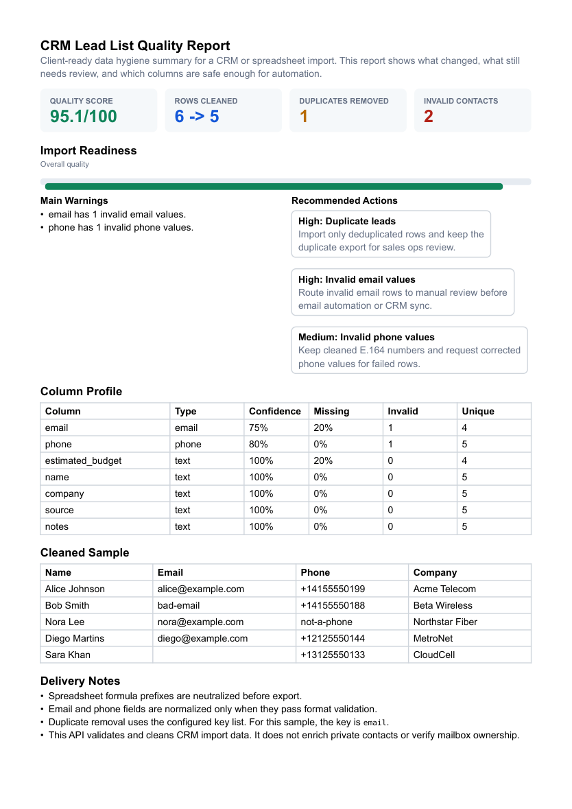

# CRM Lead List Cleaning API

[](https://github.com/emirhuseynrmx/data-quality-cleaning-api/actions)
[](https://www.python.org/)

A small FastAPI service for cleaning lead-list CSV/JSON data before it is imported into a CRM, spreadsheet, dashboard, or automation workflow.

I built this around a common data problem: lead lists usually arrive with mixed casing, duplicate rows, half-valid emails, inconsistent phone numbers, empty strings, and spreadsheet cells that should not be opened as formulas.

## What It Does

- trims messy string values
- normalizes email fields
- normalizes phone fields to E.164 where possible
- removes duplicates by selected keys
- profiles CSV/JSON records
- reports missing values, duplicate counts, inferred types, and confidence
- flags invalid email and phone values
- neutralizes risky spreadsheet formula prefixes
- accepts idempotency keys for repeat-safe POST requests
- adds request IDs, rate limits, and a small audit trail

## Endpoints

```text
GET  /health
POST /v1/email/normalize
POST /v1/phone/normalize
POST /v1/domain/parse
POST /v1/csv/profile
POST /v1/csv/clean
POST /v1/csv/upload/profile
POST /v1/csv/upload/clean
POST /v1/records/clean
GET  /ops/audit
```

## Run Locally

```bash
pip install -e ".[dev]"
uvicorn data_quality_api.api:app --reload
```

Docker:

```bash
docker build -t data-quality-api .
docker run --rm -p 8000:8000 data-quality-api
```

## Example

```bash
curl -X POST http://localhost:8000/v1/records/clean \
  -H "Content-Type: application/json" \
  -d @examples/records_clean_request.json
```

Example response:

[examples/records_clean_response.json](examples/records_clean_response.json)

## Sample Client Report

Generate a PDF report from the included messy CRM lead list:

```bash
generate-lead-quality-report data/sample_leads.csv --out outputs/sample_report
```

The report is written as Typst first, then compiled to PDF when `typst` is available:

- `outputs/sample_report/lead_quality_report.typ`
- `outputs/sample_report/lead_quality_report.pdf`



## OpenAPI

FastAPI exposes the schema at:

```text
/openapi.json
```

To export a copy into the repo:

```bash
python scripts/export_openapi.py
```

## Limits

- max CSV size: 1 MB
- max JSON records per request: 5,000
- max email/phone/domain batch size: 2,000
- default rate limit: 120 requests per minute per API key or client
- POST idempotency: send `X-Idempotency-Key` to replay the same response safely
- supported Python versions: 3.10, 3.11, 3.12

This project validates and normalizes format-level data. It does not verify whether an email inbox exists, enrich private contact data, or scrape third-party websites.
